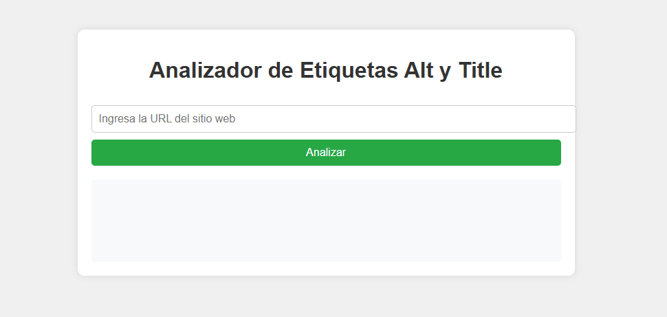

# Proyecto de Web Scraping



Este proyecto es un ejemplo práctico de cómo realizar web scraping utilizando Python. A través del uso de bibliotecas como `BeautifulSoup` y `Requests`, podrás extraer datos de sitios web de manera eficiente y ordenada. El objetivo principal es mostrar cómo navegar por el HTML de una página web y extraer la información relevante, todo mientras cumplimos con las mejores prácticas y los términos de uso de los sitios web.

## Instalación

Para empezar, asegúrate de tener Python instalado. Luego, recomendamos actualizar `pip` con el siguiente comando:

```bash
python.exe -m pip install --upgrade pip
```

Después de actualizar `pip`, puedes instalar las dependencias necesarias con el siguiente comando:

```bash
pip install -r requirements.txt
```

Esto instalará todas las bibliotecas necesarias para ejecutar el proyecto, como `beautifulsoup4`, `requests`, y cualquier otra dependencia incluida en el archivo `requirements.txt`.
